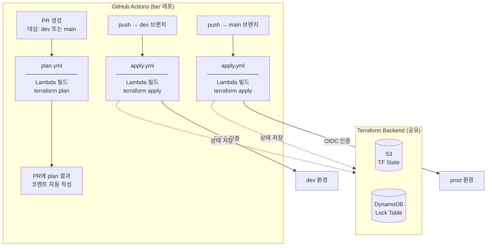
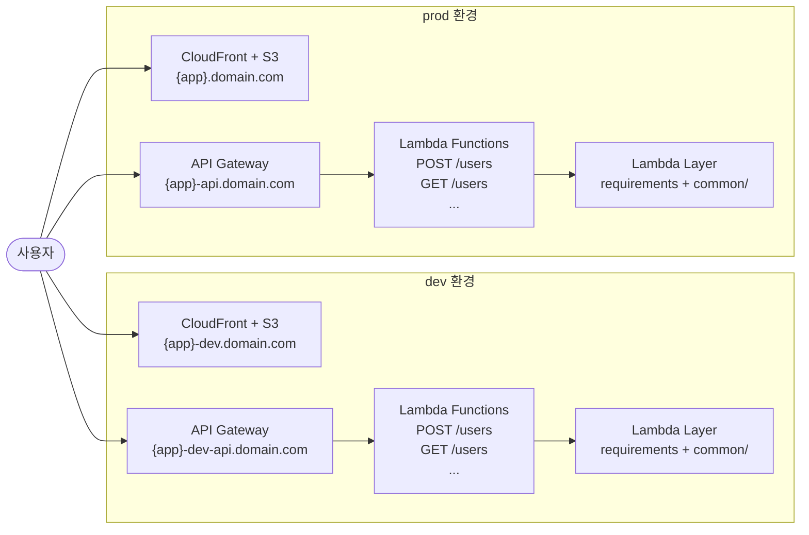

# boilerplate-app

새로운 프로젝트를 시작할 때 GitHub 레포 생성, AWS 인프라 세팅, CI/CD까지 자동으로 구성해주는 boilerplate 도구.

## 레포 구조

```
{app_name}/                 ← 이 레포 (setup 실행 위치)
├── sample.env              ← 설정 템플릿 (gitignore 제외)
├── dev.env                 ← dev 환경 설정값 (gitignore 처리)
├── prod.env                ← prod 환경 설정값 (gitignore 처리)
├── scripts/
│   ├── setup.sh            ← GitHub 레포 생성 + AWS 백엔드 초기화 (1회)
│   ├── git_setup.sh        ← GitHub 레포 생성 + submodule 등록
│   └── aws_setup.sh        ← S3 버킷 + DynamoDB 테이블 생성
├── fe/                     ← {app_name}-fe 레포 (submodule)
└── be/                     ← {app_name}-be 레포 (submodule)
```

## 연관 레포

| 레포 | 역할 |
|---|---|
| [boilerplate-fe](https://github.com/0woodev/boilerplate-fe) | Frontend 템플릿 |
| [boilerplate-be](https://github.com/0woodev/boilerplate-be) | Backend 템플릿 |

---

## 새 프로젝트 시작 가이드

### 0. 사전 도구 설치

```bash
brew install git awscli gh terraform
```

`gh auth login` 으로 GitHub CLI 인증.

### 1. 클론

```bash
git clone https://github.com/0woodev/boilerplate-app.git {app_name}
cd {app_name}
```

### 2. 환경 파일 작성

```bash
cp sample.env dev.env
cp sample.env prod.env
```

`dev.env` 편집:

```bash
PROJECT_NAME="{app_name}"          # 새 프로젝트 이름 (GitHub 레포명 기준)
STAGE="dev"
DOMAIN="0woodev.com"

GITHUB_OWNER="0woodev"             # GitHub 유저명 또는 org명
GITHUB_OWNER_TYPE="user"           # "user" | "org"
GITHUB_VISIBILITY="public"         # "public" | "private"
GITHUB_TOKEN="ghp_..."             # GitHub PAT (아래 PAT 발급 참고)

AWS_REGION="ap-northeast-2"
AWS_ACCOUNT_ID="123456789012"

# FE 도메인 (dev: https://{app_name}-dev.0woodev.com)
FE_DOMAIN="https://${PROJECT_NAME}-${STAGE}.${DOMAIN}"
```

`prod.env`는 `STAGE="prod"`, `FE_DOMAIN="https://${PROJECT_NAME}.${DOMAIN}"` 으로 설정.

#### GitHub PAT 발급

[GitHub → Settings → Developer settings → Personal access tokens → Fine-grained tokens](https://github.com/settings/tokens)

필요 권한:
- **Repository permissions** → Contents: Read and write
- **Repository permissions** → Variables: Read and write
- **Repository permissions** → Secrets: Read and write
- **Repository permissions** → Environments: Read and write
- **Repository permissions** → Administration: Read and write (레포 생성 시 필요)
- **Repository permissions** → Workflows: Read and write

> Classic PAT는 `repo` + `workflow` 스코프로도 가능.

### 3. AWS CLI 설정

```bash
aws configure
# AWS Access Key ID, Secret Access Key, Region 입력
```

IAM 사용자에 최소 권한: `S3FullAccess`, `DynamoDBFullAccess`, `IAMFullAccess`, `IAMOpenIDConnectProvider:*`

### 4. 초기 세팅 실행 (1회)

```bash
bash scripts/setup.sh
```

실행 결과:
1. GitHub에 `{app_name}`, `{app_name}-fe`, `{app_name}-be` 레포 생성
2. `boilerplate-fe` / `boilerplate-be` 클론 → boilerplate 코드를 새 레포에 push
3. `fe/`, `be/`를 git submodule로 등록
4. S3 버킷 (`{github_owner}-{app_name}-tf-state`) 생성 — Terraform state 저장용
5. DynamoDB 테이블 (`{app_name}-tf-lock`) 생성 — Terraform lock용

### 5. GitHub Actions 변수 설정

```bash
# dev 환경
cd be && make gh-setup STAGE=dev

# prod 환경
cd be && make gh-setup STAGE=prod
```

설정되는 변수:

| 위치 | 변수 | 예시값 |
|---|---|---|
| Repository | `PROJECT_NAME` | `my-app` |
| Repository | `GH_OWNER` | `0woodev` |
| Repository | `AWS_REGION` | `ap-northeast-2` |
| Repository | `AWS_ACCOUNT_ID` | `123456789012` |
| Repository | `TF_STATE_BUCKET` | `0woodev-my-app-tf-state` |
| Environment: dev | `FE_DOMAIN` | `https://my-app-dev.0woodev.com` |
| Environment: dev | `BE_DOMAIN` | `my-app-dev-api.0woodev.com` |
| Environment: prod | `FE_DOMAIN` | `https://my-app.0woodev.com` |
| Environment: prod | `BE_DOMAIN` | `my-app-api.0woodev.com` |

### 6. GitHub Actions Secrets 등록

```bash
gh secret set AWS_ACCESS_KEY_ID --repo {github_owner}/{app_name}-be
gh secret set AWS_SECRET_ACCESS_KEY --repo {github_owner}/{app_name}-be
```

> 이 키는 **Step 7 (global.yml)** 실행 후에는 더 이상 사용되지 않음. OIDC로 대체됨.

### 7. OIDC Provider 생성 (1회)

GitHub → `{app_name}-be` 레포 → Actions → **Terraform Global (One-time Setup)** → Run workflow

이 워크플로우가 하는 일:
- AWS에 GitHub Actions OIDC Provider 등록
- IAM Role (`{app_name}-{stage}-github-actions`) 생성

> **반드시 1회만 실행.** 이후 모든 배포는 OIDC 인증을 사용하므로 Access Key 불필요.

### 8. 배포

#### CI/CD 흐름

| 트리거 | 워크플로우 | 동작 |
|---|---|---|
| PR → `dev` / `main` | `plan.yml` | terraform plan 후 PR에 결과 코멘트 자동 작성 |
| push to `dev` | `apply.yml` | dev 환경에 terraform apply |
| push to `main` | `apply.yml` | prod 환경에 terraform apply |

> 자세한 다이어그램은 [인프라 구조](#인프라-구조) 참고.

```bash
# dev 배포
cd be
git checkout -b dev
git push origin dev

# prod 배포
git checkout main
git merge dev
git push origin main
```

> `terraform/**`, `app/**`, `common/**`, `requirements.txt` 변경 시에만 워크플로우 실행됨.

apply.yml이 실행하는 것:
1. Lambda 빌드 (SHA256 증분 빌드 — 변경된 함수만 재빌드)
2. `terraform apply` — Lambda, API Gateway, IAM 등 인프라 생성/갱신

---

## 인프라 구조

### CI/CD 흐름



### AWS 런타임 구조



### 도메인 구조

| 환경 | FE | BE |
|---|---|---|
| dev | `https://{app}-dev.0woodev.com` | `{app}-dev-api.0woodev.com` |
| prod | `https://{app}.0woodev.com` | `{app}-api.0woodev.com` |

---

## 로컬 개발 (BE)

```bash
cd be
make setup        # Python venv 생성 + 패키지 설치
make local        # 로컬 서버 실행 (Flask, port 5001)

# 새 API 엔드포인트 추가
make api name=api_post_order domain=order
```

---

## 의존성

| 도구 | 용도 |
|---|---|
| `git` | 레포 클론 및 submodule 관리 |
| `aws` CLI | S3/DynamoDB 초기 생성 |
| `gh` CLI | GitHub 변수/환경 설정 |
| `terraform` | 로컬에서 plan/apply 실행 시 |
| `curl` | GitHub API 호출 (setup.sh) |
